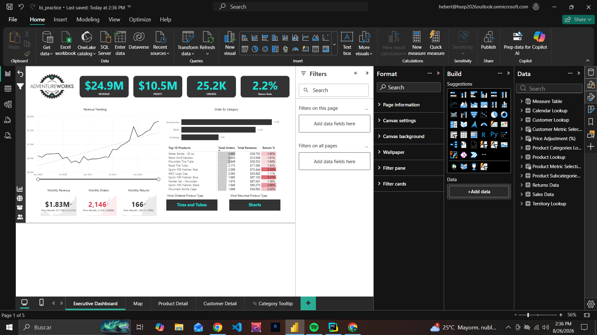
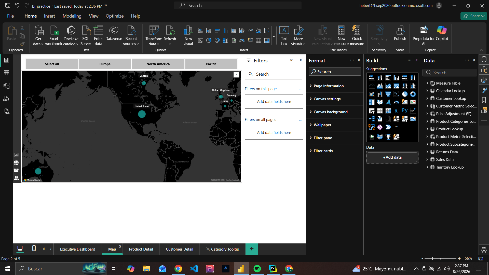
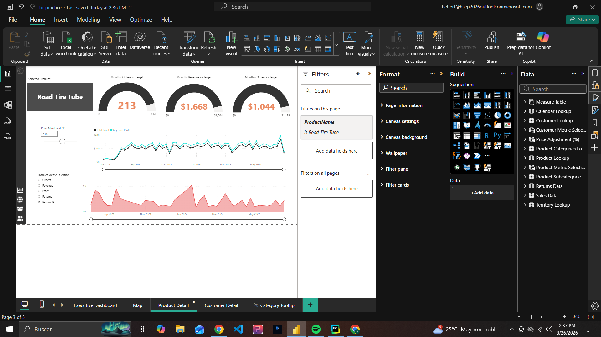
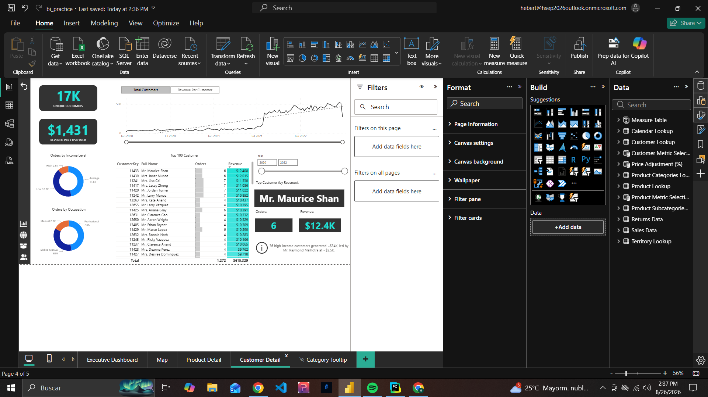
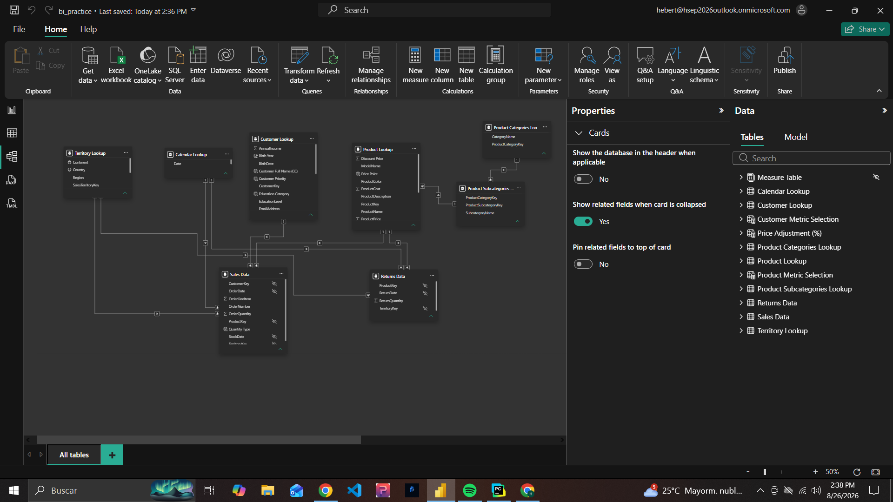

# AdventureWorks Power BI Analysis

Interactive Power BI dashboard built with the AdventureWorks dataset to practice business intelligence, data modeling, DAX, KPI development, and interactive report design.

> This project was completed as a guided Power BI learning project. The goal was to strengthen practical skills in data modeling, DAX, time intelligence, interactive reporting, drill-through, parameters, and dashboard design.

## Dashboard Overview

The report provides an interactive analysis of AdventureWorks performance across sales, customers, products, returns, and geography.

Key metrics include:

* **$24.9M Revenue**
* **$10.5M Profit**
* **25.2K Orders**
* **2.2% Return Rate**
* **17K Unique Customers**
* **$1,431 Revenue per Customer**

## Report Pages

### Executive Dashboard

High-level business performance overview including:

* Revenue
* Profit
* Orders
* Return rate
* Monthly revenue trends
* Product category performance
* Top products
* Monthly KPI comparisons



### Geographic Analysis

Interactive geographic analysis of business performance across regions including North America, Europe, and the Pacific.



### Product Detail

Detailed product-level analysis including:

* Monthly orders vs target
* Monthly revenue vs target
* Profit analysis
* Return rate analysis
* What-if price adjustment parameter
* Dynamic product metric selection
* Adjusted revenue and profit calculations



### Customer Detail

Customer-focused analysis including:

* Unique customers
* Revenue per customer
* Customer trends over time
* Customer segmentation by income
* Customer segmentation by occupation
* Top customers by revenue
* Individual customer detail metrics



## Data Model

The report uses a relational semantic model connecting sales and returns fact data with multiple lookup tables.

Main tables include:

* Sales Data
* Returns Data
* Calendar Lookup
* Customer Lookup
* Product Lookup
* Product Subcategories Lookup
* Product Categories Lookup
* Territory Lookup
* Measure Table



## Power BI Skills Demonstrated

* Data modeling
* Table relationships
* DAX measures
* KPI development
* Filter context
* Time intelligence
* Rolling calculations
* Target and variance analysis
* What-if parameters
* Field parameters
* Drill-through
* Interactive filtering
* Conditional formatting
* Dynamic metric selection
* Geographic visualization
* Report navigation
* Dashboard design

## DAX Highlights

The semantic model includes measures using functions and concepts such as:

* `SUMX`
* `CALCULATE`
* `FILTER`
* `ALL`
* `RELATED`
* `DIVIDE`
* `DATEADD`
* `DATESYTD`
* `DATESINPERIOD`
* `SELECTEDVALUE`
* `SWITCH`
* `HASONEVALUE`

Examples include:

* Total Revenue
* Total Profit
* Return Rate
* Previous Month Revenue
* YTD Revenue
* 10-Day Rolling Revenue
* 90-Day Rolling Profit
* Revenue Target Gap
* Profit Target Gap
* Order Target Gap
* Adjusted Revenue
* Adjusted Profit
* High Ticket Orders
* Weekend Orders
* Dynamic metric calculations

View the documented DAX measures here:

[View DAX Measures](dax/measures.md)

The full exported measure list is also available here:

[View DAX Export](dax/dax_measures.csv)

## Power BI File

The complete `.pbix` file is available in the repository:

[Download Power BI Dashboard](dashboard/adventureworks_powerbi_dashboard.pbix)

## Tools Used

* Microsoft Power BI Desktop
* Power Query
* DAX
* DAX Studio
* AdventureWorks dataset
* GitHub

## Project Purpose

This project was created to practice the complete Power BI workflow, including:

1. Data preparation
2. Data modeling
3. Relationship design
4. DAX measure creation
5. KPI development
6. Interactive visualization
7. Report navigation
8. Business performance analysis
9. Publishing and portfolio documentation

## Repository Structure

```text
powerbi-adventureworks-analysis/
├── dashboard/
│   └── adventureworks_powerbi_dashboard.pbix
├── dax/
│   ├── dax_measures.csv
│   └── measures.md
├── screenshots/
│   ├── executive-dashboard.png
│   ├── map-analysis.png
│   ├── product-detail.png
│   ├── customer-detail.png
│   └── data-model.png
└── README.md
```

## Learning Outcome

This project helped strengthen my understanding of Power BI beyond visualization by working with a structured semantic model, DAX calculations, filter context, time intelligence, business KPIs, dynamic reporting, and interactive dashboard functionality.

The next step is to apply these concepts in independent end-to-end BI projects using real-world business questions and datasets.
